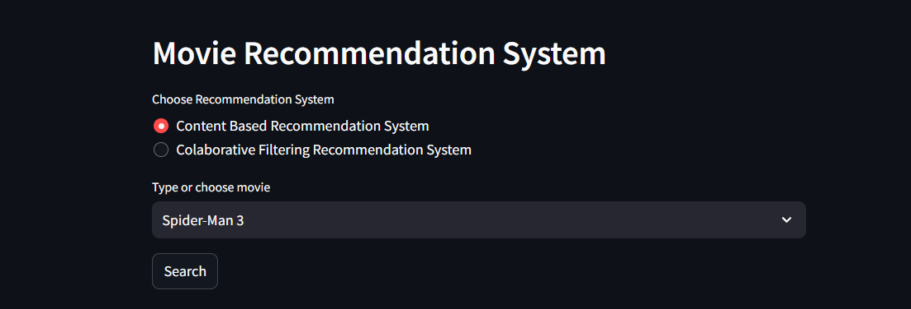
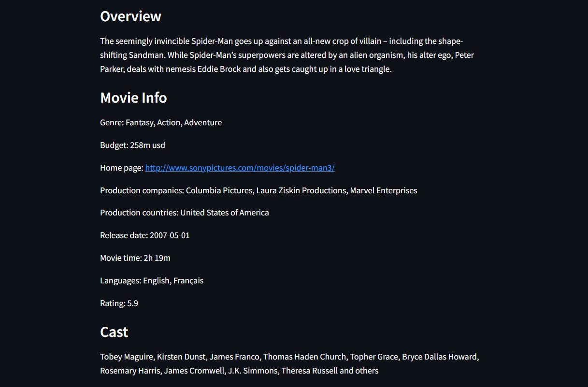
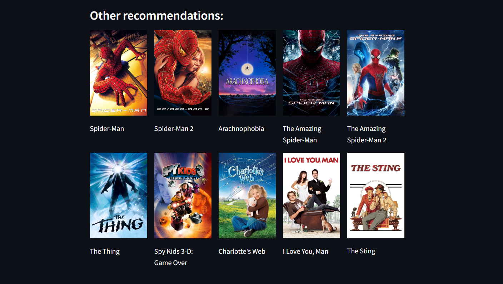
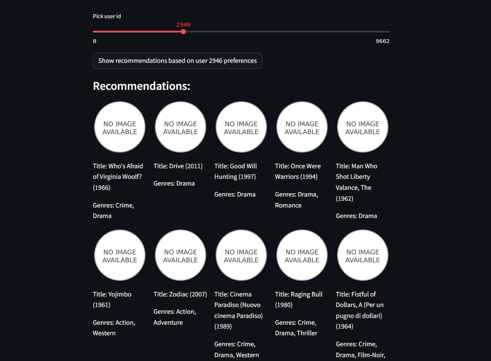

# Recommendation-system
> A recommendation system is an algorithm to suggest or recommend additional products to
> consumers. 

## Types of recommendation system used in project

### Content based
It uses the TF-IDF(term frequency–inverse document frequency) algorithm. Term frequency provides you the average number of times  when the word was mentioned inside a document. 
IDF stands for how significant this average is in the whole overview. After detecting all these words, develop a vector space model and use Cosine similarity algorithm.

**Benefits:** As It is not requiring users ratings, it benefits when there is no previous data of users.

**Drawbacks:** Content based filtering based on content and it does not count user preferences.

### Collaborative filtering based 

It will seek similarities between two users and give recommendations based on preferences of another user. NearestNeighbors algorithm was used to cluster users based on their ratings and applying k nearest neighbors algorithm to take first recommended samples.

**Benefits:** This algorithm is based on preferences of another user.

**Drawbacks:** If you have no previous data, this algorithm does not work.

## Stages of the project
- `Collecting data`
- `Analysis`
- `Preprocessing`
- `Creating a model`
1. For Content Based system: model with cosine similarity.
2. For Collaborative Filtering: model with clustering technique, because I will make clusters of users preferences.
- `Web app`

## Project overview
** Content Based Recommendation System **

** Collaborative Filtering Recommendation System **

## How to Install and Run the Project

To run this project, you need to install all attached files to this repository, go to any code editor of your choice(I used vscode). Next, activate virtual environment and run the “streamlit run app.py” command in the terminal.
